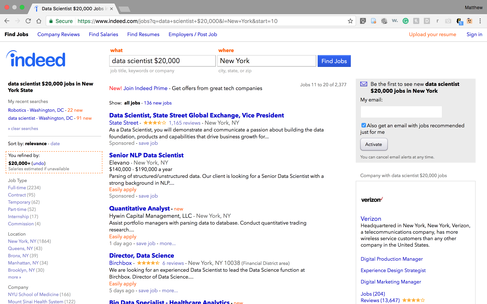

# Web Scraping for Indeed.com & Predicting Salaries

For this project, I used the Beautiful Soup library along with urllib and regex to scrape Data Science job listings from Indeed.com. While the main objective of this project was to build a functional web scraper, after collecting the data from Indeed, I built two predictive models, a logistic regression, and a random forest classifier.

A typical results page from Indeed.com

The work for this project is divided into three files:  
1. [scraper.py](./clean.py) - A Python script that scrapes job listings from Indeed.com  
1. [clean.py](./scrape.py) - A Python script that cleans the scraped data  
1. [indeed.ipynb](./indeed.ipynb) - A Jupyter notebook where data preprocessing and modeling was performed  

Using a Random Forest, I was able to predict whether a given job listing would be above or below the median scraped salary on Indeed.com with 85% accuracy on the test set. Future steps include gathering more data, performing hypothesis testing to determine the significance of certain features, and changing this to a regression problem.